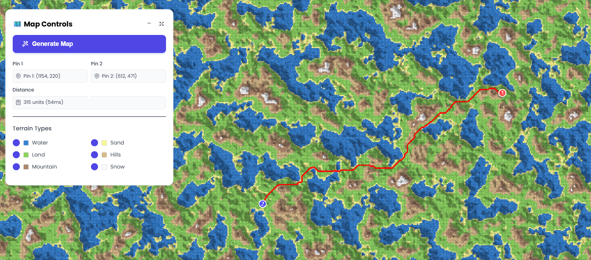

# 🗺️ Map Routing Application by Ayoub Acharki

*A web-based map routing application built with React and TypeScript.<br>This application generates terrain maps and calculates optimal routes between selected points using A\* pathfinding algorithm.*

 


## ✨ Features

### 🎯 Core Functionality
- **Interactive Map Generation**: Create new terrain maps with a single click
- **Smart Pathfinding**: A* algorithm with terrain-aware routing
- **Dual Point Selection**: Click to place two pins and automatically calculate routes
- **Real-time Distance Calculation**: Live distance updates as you select points
- **6 Terrain Types**: Water, Sand, Land, Hills, Mountains, and Snow

### 🎨 User Experience
- **Draggable Control Panel**: Professional floating interface
- **Terrain Visibility Controls**: Toggle which terrain types appear in new maps
- **Visual Feedback**: Color-coded terrain indicators and numbered pins
- **Responsive Design**: Adapts to different screen sizes
- **Modern UI**: Clean interface with icons and smooth animations

## 🚀 Quick Start

### Prerequisites
- Node.js (v14 or higher)
- (p)npm or yarn

### Installation

1. **Clone the repository**
   ```bash
   git clone <repository-url>
   cd map-routing-app
   ```

2. **Install dependencies**
   ```bash
   npm install
   ``` 
   or
   ```bash
   pnpm install
   ``` 

3. **Start the development server**
   ```bash
   npm start
   ```
   or
   ```bash
   pnpm start
   ``` 

4. **Open your browser**
   Navigate to [http://localhost:3000](http://localhost:3000)

## 🎮 Usage

1) Click “Generate Map” to create terrain
2) Click to place up to 2 pins; the route appears automatically
3) Use the panel to toggle terrain types

## 🏗️ Tech Overview

- Canvas rendering in `MapCanvas`
- Terrain generation in `utils/mapGenerator.ts` and `utils/noise.ts`
- A* pathfinding in `utils/pathfinding_quicker.ts`
- Terrain styles and costs in `utils/terrainConstants.ts`

## 🎨 Terrain Types

| Terrain | Color | Movement Cost | Description |
|---------|-------|---------------|-------------|
| 🌊 Water | Blue | ∞ (Impassable) | Cannot be traversed |
| 🏖️ Sand | Yellow | 3 | Beach areas near water |
| 🌱 Land | Green | 1 | Standard traversable terrain |
| 🏔️ Hills | Brown | 2 | Rolling hills with moderate difficulty |
| ⛰️ Mountains | Dark Brown | 4 | High elevation, slow movement |
| ❄️ Snow | White | 5 | Snow-capped peaks |

## 🔧 Development

### Project Structure
```
src/
├── components/
│   ├── MapCanvas.tsx           # Main map component
│   ├── FloatingPanel.tsx       # Control interface
│   └── styles/                 # Component styles
├── utils/
│   ├── mapGenerator.ts         # Terrain generation
│   ├── noise.ts                # Noise generation
│   ├── pathfinding_quicker.ts  # Optimized A* pathfinding
│   └── terrainConstants.ts     # Terrain definitions
└── App.tsx                     # Main application
```

### Libraries / Sources

- **fast-simplex-noise**: Core 2D noise used by `noise.ts` to generate fractal terrain.
- **Mantine**: UI components, hooks, forms, and notifications.
- **@tabler/icons-react**: Icon set for a modern UI.

References and inspiration:
- [Reddit: First attempt at random 2D terrain maps in JS](https://www.reddit.com/r/proceduralgeneration/comments/10jv9s7/first_attempt_at_random_2d_terrain_maps_in_js/)
- [Article: A* Search Algorithm (Java example)](https://codegym.cc/groups/posts/a-search-algorithm-in-java)
- [Video: A* Pathfinding explained](https://www.youtube.com/watch?v=3Dw5d7PlcTM)

## 🧮 Algorithm Details

### Pathfinding Algorithm
- **Algorithm**: A* with Euclidean heuristic
- **Terrain Integration**: Movement costs based on terrain type
- **Diagonal Movement**: √2 cost multiplier for diagonal paths
- **Performance**: Optimized with proper open/closed set management

### Terrain Generation
- **Noise Type**: Fractal Perlin noise with 4 octaves
- **Persistence**: 0.5 for realistic terrain variation
- **Normalization**: Ensures full 0-1 range utilization
- **Beach Logic**: Smart sand placement near water boundaries

## 📄 License

This project is licensed under the MIT License - see the LICENSE file for details.